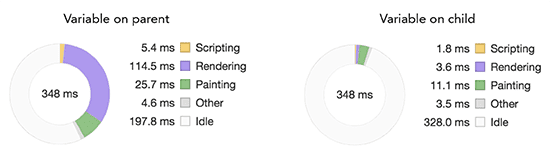
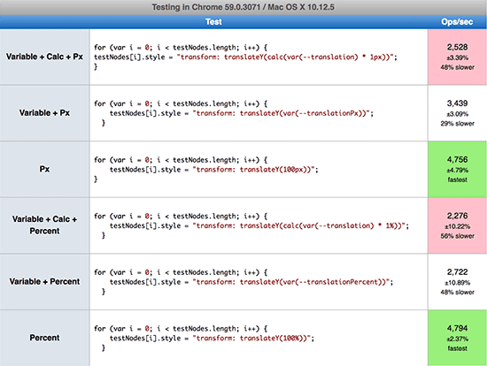

::: tip
1. 作用域与优先级
2. 样式的继承和重新计算
3. CSS 变量与 calc() 一起使用的几种方式及其对比
4. 浏览器支持情况
5. 使用 JS 设置 CSS 变量的几种方法及其对比
:::

距离 CSS 变量的出现已经有段时间了，尽管仍然缺乏一些浏览器的支持（主要是 IE 和 Edge），但 CSS 变量提供了一种很好的新方式来构建和与 CSS 进行交互。 为了进一步了解 CSS 变量对性能的影响，我们必须理解作用域的基本原理，因为它也适用于 CSS 变量。

## TL;DR

- 注意样式的重新计算，因为 CSS 变量是可继承的，更改父元素上样式会影响许多子元素
- 最好是对元素使用单个类，以使得浏览器对样式的计算变得更为容易
- `calc()` 这种计算方式有较好的性能，但是在某些特定的单位计算上仍然有问题（例如 `deg` 和 `ms`）
- 在 JavaScript 中给元素设置 CSS 变量，最好是使用 `setProperty` 而不是用内联样式

## 全局作用域 vs 局部作用域

作用域的概念在大多数编程语言中都存在，它定义了变量是在整个文档中生效，还是仅仅在文档的子部分生效(例如在 CSS 类中)。对于 CSS 变量，我们可以像下面这样在全局作用域内定义变量：

```css
:root {
	--main-color: tomato;
}
```

如果希望这些变量只对特定的组件生效，可以只在局部定义它：

```css
.title {
	--title-color: aqua;
	color: var(--title-color);
}
```

CSS 变量强大的地方在于，**它们是动态的**，因此可以在不同的作用域和运行时进行更改。所以，在 `title-color` 中可以不去定义一个新的变量 `--title-color`，我们只需要更改全局作用域中的 `--main-color` 就可以了，这种更改只会影响这个特定的组件。

```css
.title {
  --main-color: aqua;
	color: var(--main-color);
}
```

## 作用域和优先级

在像 SASS 这样的 CSS 预编译工具中，嵌套 CSS 是很常见的，但这常常会导致选择器非常的复杂：

```css
.card .heading .title { ... }
```

为了解决这个问题，引入了 [BEM](http://getbem.com/) 这种以以类为中心的规范，来为每个元素设置一个类来降低优先级：

```css
.card { ... }
.card__heading { ... }
.card__title { ... }
```

## 继承和样式的重新计算

为了理解作用域对性能的影响，我们首先必须了解浏览器如何处理样式的计算。

例如下面的代码:

```css
.box:nth-last-child(-n+1) .title {
  /* styles */
}
```

为了知道是否需要应用样式，浏览器实际上必须询问“这是否为有 `title` 类的元素，其父元素恰好是负第 N 个子元素加上 1 个带 `box` 类的元素？”计算此结果可能需要大量时间，具体取决于所用的选择器和相应的浏览器。

使用像 BEM 这样的单个类，使得样式计算对于浏览器来说更加容易，因为它不再需要比较所有的元素和它的兄弟元素来决定应用什么样式。

## 作用域和 CSS 变量

由于 CSS 变量是可继承的，更改它们会导致所有子元素的样式重新计算。这不仅仅适用于 CSS 变量，也适用于其他可继承的属性，如颜色或字体。

通常，默认值为 `inherit` 的 CSS 属性在绝大多数情况下会导致大量的计算重新样式。不断地更改 CSS 变量也会对性能产生影响。一个避免这个问题的方案是在最特定的层级（或最深的选择器）改变 CSS 变量，以防止大量的子元素受到影响而重新计算样式。

因此，如果我们要动态地更改 CSS 变量，应该在局部作用域而不是全局作用域中进行，以避免大量的样式重新计算。

## 样式重新计算示例

现在有一个容器，容器内部有 25000 个子元素，为了测试在容器上设置 CSS 变量和在它的子元素上直接设置变量之间的区别，用下面的 HTML & CSS 创建了一个 Codepen。

```html
<div class="container">
  <span class="el"></span>
... 25000 more elements
</div>
```

```css
.el {
	background: var(--bg, orange);
}
```

通过 Javascript, 首先将 `--bg` 变量设置在容器 `.container` 上，这导致了 76ms 相当长时间的样式重新计算。接着在第一个子元素 `.el` 上设置相同的变量，样式重新计算时间只有 1.9ms。因此，父元素使用这个变量的子元素越多，在这个元素上设置 CSS 变量的开销就越大。



## 将 CSS 变量与 Calc() 一起使用

当我们将 CSS 变量与 `calc()` 函数组合在一起时，它会变得更加强大。特别是对于数值的转换，定义一个多个属性的值相同的没有单位的变量，在它们各自的属性中设置这个变量对应的单位。到目前为止，`calc()` 主要用于计算响应式元素的宽高。例如，让 `div` 宽度比 `100%` 小 `100px`，可以：

```css
.container {
  width: calc(100% - 100px);
}
```

结合 CSS 变量，`calc()` 更加强大。向一个没有单位的 CSS 变量添加单位:

```css
:root {
	--duration: 2000;
}

div {
  animation-duration: calc(var(--duration) * 1ms);
}
```

### 使用 `calc()` 的性能

当结合使用 `calc()` 和无单元的 CSS 变量时，性能会成为一个问题。为了了解更多关于性能问题的信息，创建了一个 jsPerf 测试用例，来测试使用 `calc()` 和不使用 `calc()` 设置属性的几个不同选项。以下是测试的六种方法:

- variable + calc + px: 使用 `calc()` 将无单位的 CSS 变量乘以 `1px`
- variable + px: 设置一个包含 `px` 值的 CSS 变量
- px: 设置硬编码的 `px` 值
- variable + calc + percent: 使用 `calc()` 将一个无单位的 CSS 变量乘以 `1%`
- variable + percent: 设置一个包含 `%` 值的 CSS 变量
- percent: 设置硬编码的 `%` 值

如下所示，直接设置硬编码值是最快的（用例 3 和 6），接着是设置一个含有单位值的 CSS 变量（用例 2 和 5）。使用 `calc()` 设置一个无单元的 CSS 变量是最慢的，但并不比前面的方法慢多少（用例 1 和 4）。



## 浏览器支持情况

一些浏览器在支持 `calc()` 方面仍然存在问题。从积极的一面来看，所有支持 CSS 变量的浏览器，也都支持与 `px`、 `vmin`、 `rem` 和其他线性距离单位一起使用 `calc()`。另一方面，Firefox 和 Edge 在其他单位类型如 `%` 、`deg` 或 `ms` 方面也存在问题。 `calc()` 的这些问题阻碍了许多 CSS 变量的开发，但是渐进增强的使用方式允许在这些受影响的浏览器中使用回退（fallback）。

## 使用 JS 设置 CSS 变量

David Khourshid 创建了一个 [jsPerf](https://jsperf.com/css-variables-vs-inline-styles) 测试用例，其中他比较了使用 JavaScript 设置样式的三种不同的方法。通过调整这个测试，我们在这个 [jsPerf](https://jsperf.com/css-variables-vs-inline) 测试中比较了以下情况:

首先，设置内联样式:

```js
element.style = ’color: green’;
```

其次，使用 `setProperty` 语法设置样式:

```js
element.style.setProperty(’color’, ’green’);
```

第三种方法也使用 `setProperty`，但是用于设置一个 CSS 变量:

```js
element.style.setProperty(’--color’, ’green’);
```

最后一个测试用例通过内联样式设置 CSS 变量:

```js
element.style = "--color: green";
```

测试用例被多次应用于 100个 HTML 元素。与 `element.style.setProperty` 操作相比，Safari 在设置内联样式方面快得多。另一方面，在 Chrome 中，通过内联样式或 `setProperty` 设置 CSS 变量并没有太大的区别。有趣的是，Firefox 在设置内联样式方面明显落后。因此，跨浏览器首选 `setProperty`。在所有三种浏览器中，直接设置样式比设置 CSS 变量更快。

## 总结

当使用 CSS 变量时，我们总是需要知道变量是在哪个作用域内定义的，如果改变它，是否会影响许多子元素，从而产生大量的样式重新计算。

结合使用 `calc()` 和 CSS 变量是获得更大灵活性和限制我们需要定义的变量数量的好方法。在不同的浏览器中测试 `calc()` 与 CSS 变量的组合，没有显示任何大的性能问题。然而，一些浏览器对一些单位（如 `deg` 或 `ms`）的支持仍然有限，必须牢记这一点。

如果我们比较在 JavaScript 中通过内联样式设置变量和 `setProperty` 设置变量的性能，在不同浏览器之间有一些显著的差异。虽然通过内联样式设置属性在 Safari 中非常快，但在 Firefox 中非常慢，因此首选使用 `setProperty` 来设置变量。

## 参考

- [PERFORMANCE OF CSS VARIABLES](https://lisilinhart.info/posts/css-variables-performance)
- [How to Use CSS Variables for Animation](https://webdesign.tutsplus.com/tutorials/how-to-use-css-variables-for-animation--cms-28868)
- [Reduce the Scope and Complexity of Style Calculations](https://developers.google.com/web/fundamentals/performance/rendering/reduce-the-scope-and-complexity-of-style-calculations)
- [Making Custom Properties (CSS Variables) More Dynamic](https://css-tricks.com/making-custom-properties-css-variables-dynamic/)
