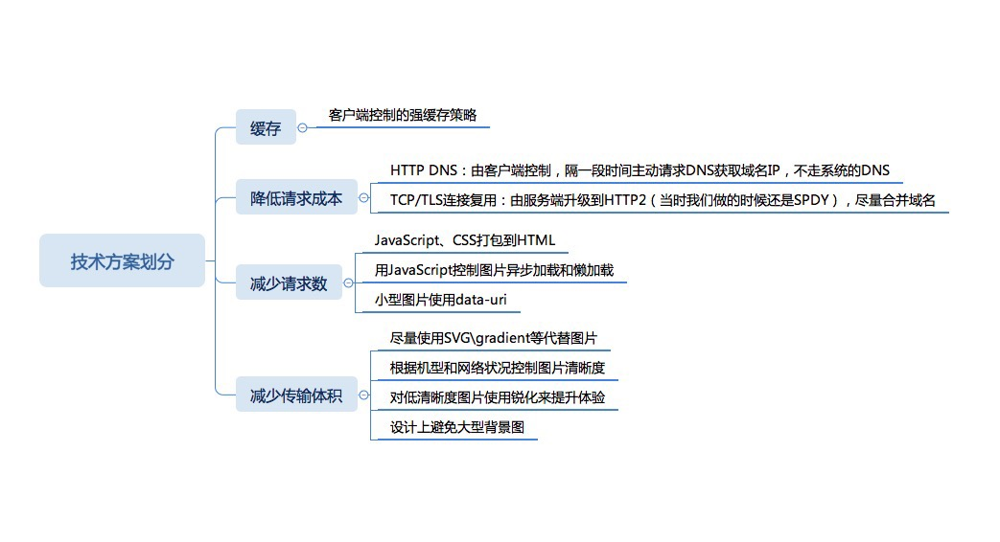

> 摘自 winter 老师 《重学前端》

## 性能总论

性能体系的建立可以分成以下部分：

 - 现状评估和建立指标
 - 技术方案
 - 执行
 - 结果评估和监控

## 现状评估和建立指标

想要做好性能优化，正确地评估现状和建立指标是最关键的一步，又往往是会被轻视的一步。

性能问题可以分成很多方面，最重要的几个点是：

- 页面加载性能
- 动画与操作性能
- 内存，电量消耗

**在对大量的用户数据分析后得出，“页面加载性能”跟用户的流失率有非常强的关联性，而用户的流失率，正是公司业务非常看重的指标。**

用什么指标来衡量页面加载性能呢？

最容易想到的方案是“用户平均加载时间”。

但是这个指标有严重的问题：

- 当加载时间低于一定数字，用户体感差别不大了，经过一定研究，这个数字大约是 1 秒
- 少数超长时间加载的用户（如 2G），会极大影响整个指标，即指标不能反映大多数用户的体验

基于以上分析，设计了一个新的指标————秒开率，即一秒之内打开的用户占用户总量的百分比。

## 技术方案

有了指标，就有了优化的目标，接下来，就是技术了。

以加载过程为例，首先简单分析一下，从输入 URL 后按下回车，到底发生了什么。

见[一个浏览器是如何工作的](/articles/JavaScript/一个浏览器是如何工作的)

必须理解几件事：

- 从域名到 IP 地址，需要用 DNS 协议查询
- HTTP 协议是用 TCP 传输的，所以会有 TCP 建立连接过程
- 如果使用 HTTPS，还有 HTTPS 交换证书
- 每个网页还有图片等请求

网页的加载时间不但跟体积有关，还跟请求数有很大关系，最终的技术方案大约可以这样划分：

可以看到，这里涉及的并不仅仅是前端技术，有服务端，客户端，设计师团队，所以要想做好性能优化，必须是整个业务一起考虑，才能有良好的收效。

## 执行

有了技术方案，只完成了一半的工作，接下来还需要一个执行过程。

执行也不简单，如果说方案主要靠技术，那么执行就是靠工程实施。

根据公司的实际情况，工程实施可能有不同的程序，把工程水平从低到高分成三个阶段：

- 纯管理
- 制度化
- 自动化

纯行政管理，是由经理用纯粹的管理手段来执行方案，比如说，作为前端团队的 Leader，组织会议，要求整个团队使用我们前面谈的技术方案。但是有一些问题，一方面，需要的行政资源不一定有，比如我没法强制让后端团队配合我，另一方面，纯粹的管理方式，团队本身的体验并不好，也不利于团队成长，最重要的是，容易造成执行不到位。这样的执行方式多数出现在非技术岗位。

制度化执行方式是用规则代替人的命令，指定责任人，通过培训，checklist，定期 review 等具体措施来保证实施。制度化执行可以极大地减轻管理工作量，一般现代互联网公司都会采用类似的方式。但是制度化执行方式还有很大成分是依靠人的主动性的，对程序员来说，还有更好的方式：自动化。

自动化的方式是在一些重要的操作路径上设置规则，针对我们的性能优化，有两个点适合做这件事：一个是把开发好的页面发布上线，另一个是开发好的页面 URL 投放到首页等处的链接。

## 结果评估和监控

执行完了之后，还要有一定的结果总结，才是一个完整的工程实施，而且，凡是工程实施，肯定要有一定长效机制，不能优化完了退化，这些都要求有线上监控机制。

要想做线上监控，分两部分：

- 数据采集
- 数据展现

数据采集部分，同样需要发布平台或者开发工具来配合，对性能数据来说， Performance API 非常好用，它是浏览器记录的性能数据，一般来说，我们用统一的代码把它上传到服务器端就够用了。

数据的展现部分比较自由，可以用不同的数据可视化方案来展现性能数据，没有一定之规。一般的数据监控平台，会提供报警机制，对性能来说，报警需求不是特别强烈，但是可以设置一些条件，针对秒开率特别低的网页报警。

有了监控，再配合一定制度，就可以保障整个团队产出的性能了。

性能不是一个静态的事情，指标需要不断优化，技术方案还需要不断随着技术发展迭代，制度、自动化工具也需要不断改进，最终的监控平台产品也不能不做新需求，所以性能应该成为一个团队的日常工作的一部分，持续进行。

## 总结

总体思想：性能应该是基于业务和实际用户体验需求的一种工程实施，不是纯粹的技术游戏。

性能工程体系的四个步骤：

- 现状评估和建立指标，建立指标应当从业务的角度考虑
- 技术方案设计，技术方案应当从整体角度，基于 Profiling 的结果分析来设计
- 实施，工程实施的三个层次：纯管理、制度化、工程化
- 结果评估和线上监控，线上监控需要从数据采集和数据展现来个部分分别实现
