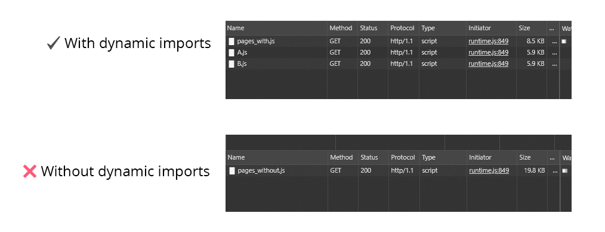
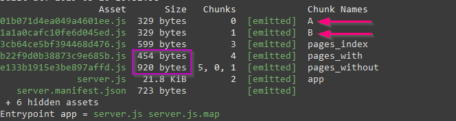

我敢打赌，你已经对术语[**“代码拆分”**](https://webpack.js.org/guides/code-splitting/)和"**懒加载**"很熟悉了。让我们从[webpack文档中](https://webpack.js.org/guides/lazy-loading)获取懒加载的定义：

> 懒加载，或者“按需“加载是优化站点或应用程序的好方法。这种做法本质上涉及在逻辑断点处拆分代码，然后在用户需要或者将要需要新代码块的地方加载代码。这会加快应用程序的初始加载速度，并减少整体的代码体积，因为某些块甚至永远不会加载。

[正如一些人建议的那样](https://twitter.com/slightlylate/status/1018880523446337536)，这种功能默认情况下应由我们使用的框架来完成。（[React 生态系统](https://twitter.com/slightlylate/status/1031934342132461568)中也是）

## 重点

只要有可能，我建议使用动态引入来引入组件。必要时，它们将被懒加载（由 webpack 加载）。

```js
// Instead of a usual import
import MyComponent from "~/components/MyComponent.js";

// do this
const MyComponent = () => import("~/components/MyComponent.js");
```

## 说明

当使用 webpack 打包你的应用程序时，你可以使用不同的方式来处理模块（ES 模块，CJS，AMD...）。如果你使用 ESM 方式（推荐），你可以使用以下的语法：

```js
import MyComponent from "~/components/MyComponent.js";
```

注意，在这里有几种我们要使用异步组件的用例。正如 Alex Jover 在[这篇文章](https://alexjover.com/blog/lazy-load-in-vue-using-webpack-s-code-splitting/)中所解释的：

- 在组件引入中
- 在 Vue Router 中，用于组件映射
- 在 Vuex 模块中

让我们来看看语法，并关注`import`部分。

如果你正在使用 webpack（或者[Parcel](https://parceljs.org/)），那么该语法将在编译时进行转换，并且这些工具将使用 `Promise` 来异步加载你的资源/模块/组件。

为什么需要使用箭头函数，你可能会感到奇怪：正如 Alex 解释的，我们需要使用箭头函数来包裹 `import`，仅在执行时才会 `resolve`。(记住， `Promise`)。

为了演示它们是完全懒加载的，我准备了一个[仓库](https://github.com/gangsthub/dynamic-imports-example)（使用 Nuxt.js）。它有 2 个页面，每个页面使用了不同的技术（**带有**和**不带有**动态引入）引入 2 个组件（组件“A” 和 “B”）。

我们将看到，使用动态引入加载页面时，webpack 在页面导航后加载了 2 个单独的文件。但使用常规导入的页面组件（`/without`）加载的任务更重，因为它一次性加载所有内容。



该图显示了导航到两个页面时的网络瀑布。以及两种技术之间的差异（有无动态引入）。

是的，使用这种技术，webpack 将创建单独的文件（“chunk”）以在需要的时候（懒）加载它们。自定义 chunk 命名可以使用 [Magic comments](https://webpack.js.org/api/module-methods/#magic-comments)完成。但这将是另一篇文章的主题了 😉。



图片显示了 Nuxt 构建的结果。看看在使用动态引入时为组件 A 和 B 创建的不同 chunk！

**以上！**

要深入研究代码拆分技术，请看：

- De facto linked article by Anthony Gore: [https://vuejsdevelopers.com/2017/07/03/vue-js-code-splitting-webpack/](https://vuejsdevelopers.com/2017/07/03/vue-js-code-splitting-webpack/)

- Google’s web fundamentals article by Addy Osmani and Jeremy Wagner about code splitting: [https://developers.google.com/web/fundamentals/performance/optimizing-javascript/code-splitting/](https://developers.google.com/web/fundamentals/performance/optimizing-javascript/code-splitting/)

- Webpack docs: [https://webpack.js.org/guides/code-splitting/](https://webpack.js.org/guides/code-splitting/)

*PS: 对于此示例库，我使用了 webpack@4.29.6 和 Nuxt@2.4.0，后者使用了 Vue@2.5.22。*

### [原文链接](https://vuedose.tips/tips/dynamic-imports-in-vue-js-for-better-performance)
