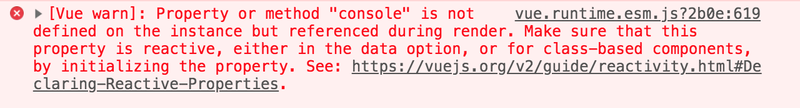
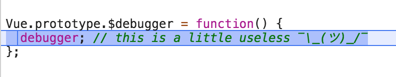
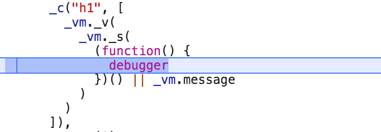
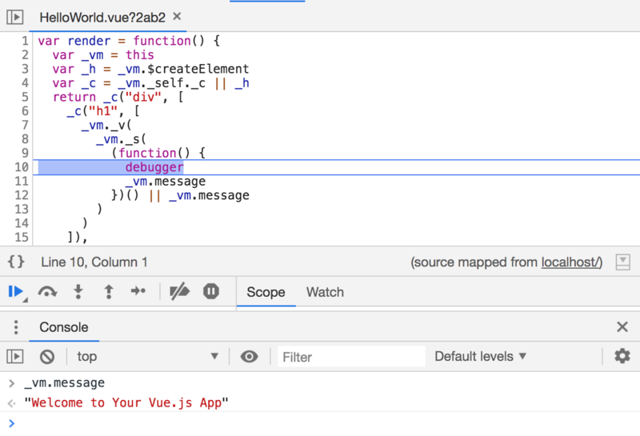

[Vue.js DevTools](https://chrome.google.com/webstore/detail/vuejs-devtools/nhdogjmejiglipccpnnnanhbledajbpd) 非常棒，它可以检查你的应用程序。但有时，你可能想要调试模板中发生的事情。如你所知，你可以把 JavaScript 表达式放在那里，也许你试过把 `console.log` 放在模板里，然后遇到这种情况：

```html
<h1>{{ console.log(message) }}</h1>
```



这是由于你放置在模板中的所有内容 Vue 都试图在实例中找到它，因此一个快速的解决方案是写一个组件的 `log` 方法以便在模板中让 Vue 找到它：

```js
methods: {
  log (message) {
    console.log(message);
  }
}
```

并使用

```html
<h1>{{ log(message) }}</h1>
```

但是这是你偶尔会在不同的组件中想要的东西，并且一直重复此代码有些无聊，所以我们可以做的是[添加一个实例属性](https://vuejs.org/v2/cookbook/adding-instance-properties.html)，在 `main.js` 中将我们自定义的 `log` 方法放置在 `Vue.prototype` 上：

```js
// main.js
Vue.prototype.$log = console.log;
```

现在我们可以在每个组件的模板中使用 `$log`，并且如果我们不想干扰渲染，只需要用 OR 运算符来使用 JS 的惰性求值：

```html
<h1>{{ $log(message) || message }}</h1>
```

不可思议吧？:D，但是，如果我们要放置一个断点以便在模板周围静默地调试一些变量，该怎么办？

如果我们在模板中写入 `debugger`：

```html
<h1>{{ debugger }}</h1>
```

它甚至没有编译模板！😱并且如果采用与以前相同的策略，我们将断点在原型函数中而不是我们想要调试的模板中：



因此，为了在模板的中间加一个断点，我们可以使用一些技巧将 `debugger` 包装在 [IIFE](https://developer.mozilla.org/en-US/docs/Glossary/IIFE)（立即调用函数表达式）中，就像：

```html
<h1>{{ (function(){debugger;})() || message }}</h1>
```

我们会发现自己处于被编译的 render 函数的中间：



在这里的 “_vm” 变量

[表示ViewModel](https://vuejs.org/v2/guide/instance.html)

它是我们组件的实例:)。检查已编译的模板也很有趣，但是由于某些原因，这些变量在 chrome devtools 的函数作用域内获取不到，我们只能放到 `debugger` 后面：

```html
<h1>{{ (function(){debugger;message})() || message }}</h1>
```

现在你可以检查周围的一切了！



就这样！我希望借助这些技巧，你将发现自己对调试 Vue 模板更有信心，并乐于检查编译后的渲染函数的内部。

### [原文链接](https://vuedose.tips/tips/debugging-templates-in-vue-js)
