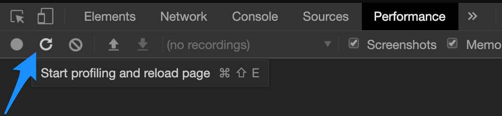
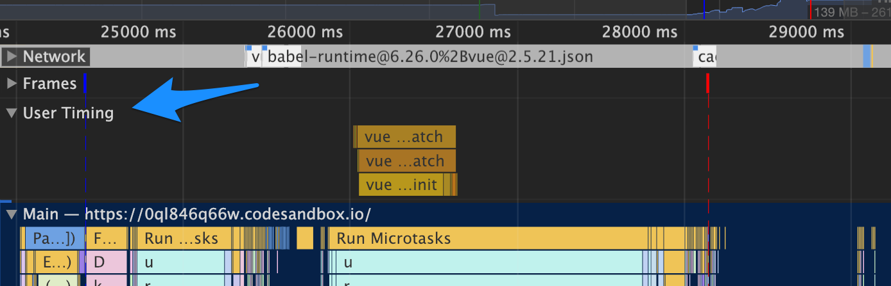
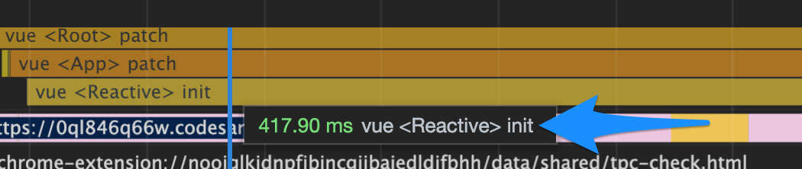
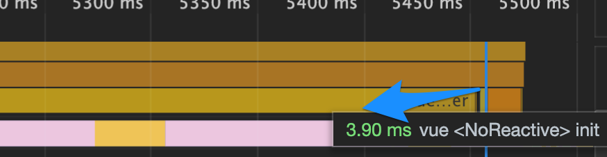

在[提高 Vue 中大型列表的性能](/articles/Vue/VueDose/1-提高%20Vue%20中大型列表的性能)中，我们讨论了如何在大型列表中去提升性能。但是我们仍然无法衡量它真正改善提升了多少。

我们可以使用 `Chrome DevTools` 中的 `Performance` 标签来做到这一点。但是为了获得准确的数据，我们必须在 `Vue` 应用程序上**激活性能模式**。

我们可以在 `main.js` 文件中或者插件中（对于`Nuxt`）设置全局变量来做到这一点：

```js
Vue.config.performance = true;
```

或者，如果你正确设置了 `NODE_ENV` 环境变量，则可以在非生产环境中使用它来设置：

```js
const isDev = process.env.NODE_ENV !== "production";
Vue.config.performance = isDev;
```

这会激活 Vue 内部用来标记组件性能的 [User Timing API](https://developer.mozilla.org/en-US/docs/Web/API/User_Timing_API)

我已经创建了[这个 CodeSandbox](https://0ql846q66w.codesandbox.io/)。打开它然后点击 `Chrome DevTools` 上 `Performance`标签上的 `reload` 按钮：



这将会记录页面加载性能。由于有了你在 `main.js` 里的 `Vue.config.performance` 设置，你可以看到 `User Timing` 部分：



在这里，你会发现三个指标：

- **Init**：创建组件实例所需的时间
- **Render**：创建 VDom 结构的时间
- **Patch**： 挂载 VDom 到实际 DOM 的时间

回到好奇心，[提高 Vue 中大型列表的性能](/articles/Vue/VueDose/1-提高%20Vue%20中大型列表的性能)的这篇文章的结果如下： 正常组件**需要 417ms 去初始化**：



同时使用`Object.freeze`的非响应式例子需要 **3.9ms的时间**：



当然，每次运行之间的差异可能会有所不同，但两种情况的相差仍然很大。因为响应式的构建发生在组件创建阶段，因此你会在 `Reactive` 和 `NoReactive` 组件的 `init` 部分中看到这种差异。

以上。

### [原文链接](https://vuedose.tips/tips/measure-runtime-performance-in-vue-js-apps/)
