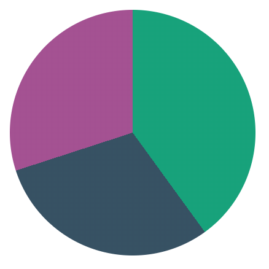

在上一个 Tip 中，展示了[使用 CSS Scroll Snap 和 Vue.js 的最现代的轮播组件](/articles/Vue/VueDose/25-使用%20CSS%20Scroll%20Snap%20和%20Vue.js%20的最现代的轮播组件)。这次，我们构建一个饼图！

这次我向你展示另一个 CSS 新特性：**Conic Gradient**。

有了它，我们可以轻松地构建饼图组件。实际上，构建调色盘组件非常容易，但这是另一个主题！

为了构造饼图，我们需要定义 conic gradient 的每个部分，该部分用 `background` CSS 属性。

例如，如下饼图：

<p align="center">
  
</p>

使用以下 CSS 规则定义：

```css
background: conic-gradient(
  #00A37A 0 40%,
  #365164 0 70%,
  #A54f93 0 100%
);
```

如你所见，必须在每个部分定义颜色，距中心的位置（在这种情况下始终为 0）已经该部分必须所占据的角度。

该部分的角度必须是绝对的：它们就像在 Z index 中相互重叠的不同层一样。但是，你可能想将每块占据的部分传递给饼图，就像是：

```js
{
  pieData: [
    { color: "#00A37A", value: 40 },
    { color: "#365164", value: 30 },
    { color: "#a54f93", value: 30 }
  ]
}
```

这样，当你汇总所有 pieData 值时，它们总计为 100。

有了这个介绍，让我们构建一个 `PieChart.vue` 组件。该组件必须采用上述 `pieData` 结构，并根据数据构建正确的 `background: conic-gradient(...)` 值：

```vue
<template>
  <div class="pie-chart" :style="pieStyles"></div>
</template>

<script>
export default {
  props: ["pieData"],
  computed: {
    pieStyles() {
      let acum = 0;
      let styles = this.pieData.map(
        segment => `${segment.color} 0 ${(acum += segment.value)}%`
      );

      return {
        background: `conic-gradient( ${styles.join(",")} )`
      };
    }
  }
};
</script>

<style scoped>
.pie-chart {
  border-radius: 50%;
}
</style>
```

首先，请注意我们给了它 50% `border-radius` 让它变圆。

该组件的重要部分位于 `pieStyles` 计算属性中。基本上，我们映射该 `pieData` 属性来构建具有 `#aeaeae 0 30%` 形式的圆锥部分的数组，最后将其构建在 `background` CSS 属性中。

这样，对于以下数据：

```js
{
  pieData: [
    { color: "#00A37A", value: 40 },
    { color: "#365164", value: 30 },
    { color: "#a54f93", value: 30 }
  ]
}
```

`pieStyles` 计算属性将返回：

```css
background: conic-gradient(
  #00A37A 0 40%,
  #365164 0 70%,
  #a54f93 0 100%
);
```

就是这样，它成功了！

### [CodeSandbox](https://codesandbox.io/s/piechart-component-example-iv1yu)

### [原文链接](https://vuedose.tips/tips/the-most-modern-pie-chart-component-using-css-conic-gradient-and-vue-js)
