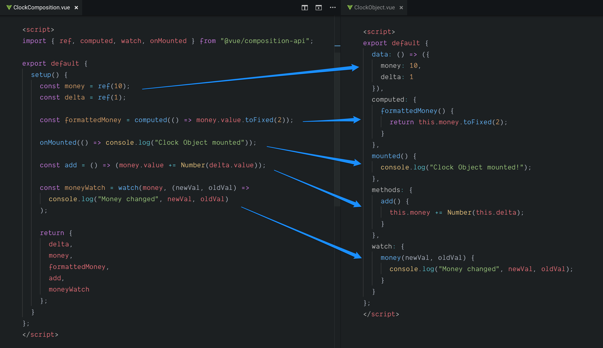

Vue.js 3 已经达到 Alpha 版本的事情让我觉得...现在是该来点 Vue.js 3 的 Tip 了！

这个初衷是为你提供一些与新功能相关的技巧，你可以在 Vue.js 3 上找到这些功能。现在，我们将专注于 **Composition API**，这是最具颠覆性的功能之一！

第一个重点是向你展示一个基本的循序渐进指南或备忘录，来把基于对象 API 的 Vue.js 组件迁移到 Composition API。在以后的 Tip 中，你还将看到如何应用此 API 来做一些新的技术😉。

我将向你展示如何将基于对象 API 的组件转换为使用 Composition API。

为此，让我们创建一个 `MoneyCounter.vue` 组件，该组件基础的显示一个金额并允许我们*添加/减少*数值，该组件用以下代码实现：

```vue
<template>
  <div>
    <h2>{{ formattedMoney }}</h2>
    <input v-model="delta" type="number">
    <button @click="add">Add</button>
  </div>
</template>

<script>
export default {
  data: () => ({
    money: 10,
    delta: 1
  }),
  computed: {
    formattedMoney() {
      return this.money.toFixed(2);
    }
  },
  mounted() {
    console.log("Clock Object mounted!");
  },
  methods: {
    add() {
      this.money += Number(this.delta);
    }
  },
  watch: {
    money(newVal, oldVal) {
      console.log("Money changed", newVal, oldVal);
    }
  }
};
</script>
```

该组件具有 `money` 状态来保存数值，`delta` 绑定使用 `v-model` 的输入框，然后在 `add` 方法中将用于添加数值到 `money`。计算属性 `formattedMoney` 正确显示保留两位小数的 `money`。最后，我还提供了带有 `console.log` 语句的 `watch` 和 `mounted`，目的是演示如何将其迁移到 Composition API。

如果有必要，请花一些时间来了解此组件。

然后，创建一个 `MoneyCounterComposition.vue` 组件。`<template>` 由于**不受 API 的影响**，因此与上一个组件保持相同的内容，因此请从上一个组件复制它。

有变化的是 `<script>` 部分。先让我们看看整个代码：

```vue
<script>
// In Vue 3, you'll import from "vue"
import { ref, computed, watch, onMounted } from "@vue/composition-api";

export default {
  setup() {
    // State
    const money = ref(10);
    const delta = ref(1);

    // Computed props
    const formattedMoney = computed(() => money.value.toFixed(2));

    // Hooks
    onMounted(() => console.log("Clock Object mounted"));

    // Methods
    const add = () => (money.value += Number(delta.value));

    // Watchers
    const moneyWatch = watch(money, (newVal, oldVal) =>
      console.log("Money changed", newVal, oldVal)
    );

    return {
      delta,
      money,
      formattedMoney,
      add,
      moneyWatch
    };
  }
};
</script>
```

首先，我们要使用 `setup` 函数导出一个对象。这是必须的，这里是所有事情发生的地方。现在，让我们一部分一部分的来看：

**State**: 使用 `ref` 来实现，你可以看到，你可以拥有任意多的状态。要访问到它们，你不需要使用 `this`，因为它只是一个变量，并不是实例上的属性，尽管要通过 `.value` 来更改其值。你也可以使用 `reactive`，但我鼓励你阅读 [Jason Yu](https://twitter.com/ycmjason) 的[这篇文章](https://dev.to/ycmjason/thought-on-vue-3-composition-api-reactive-considered-harmful-j8c)，将使用 `ref` 作为一项约定。

**Computed**: 你需要使用 `computed` 来使用它，他将一个函数作为其第一个参数。

**Hooks**: 每个钩子都有自己的公共方法。在该例子下， `mounted` 钩子是 `onMounted`，形如 `computed`，它们将一个函数作为其第一个参数。

**Methods**: 它们仅仅是函数，就像其他函数一样，没什么特别的。

**Watch**: 有不同的特征，这里是一种 watch `money` 的写法，你可以在 [RFC 文档](https://vue-composition-api-rfc.netlify.com/api.html#watch) 中查看所有的用法。

最后，该 `setup` 函数**必须返回一个对象，其中要包含你想在模板中使用的所有内容**。任何不存在的内容，都无法在模板中访问。

*小提示： 你可能注意到了我是从 `@vue/composition-api` 引入的。这是因为我是在使用一个插件，因为 Vue 3 还没有正式发布，但是有了这个插件，我们已经可以使用它。*

我希望下面的图片可以帮助你理解如何来迁移这个组件：



### [CodeSandbox](https://codesandbox.io/s/composition-api-simple-demo-lp0z5)

### [原文链接](https://vuedose.tips/tips/easily-switch-to-composition-api-in-vuejs-3)
