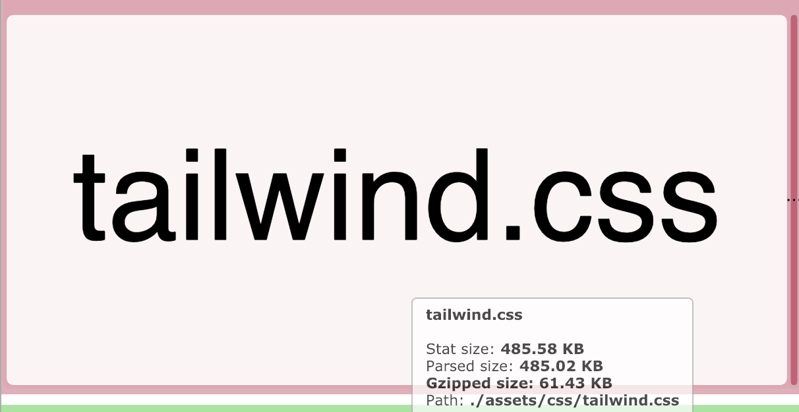
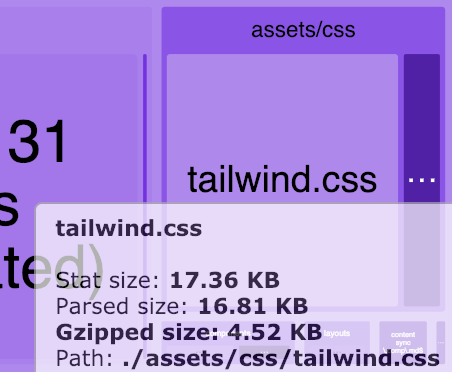

我们可以通过不同的方式处理 Web 性能，其中之一就是移除所有我们未在 App 中使用的 JS 和 CSS。

就 CSS 而言，当我们使用 `Bootstrap`，`Bulma` 或者 `Tailwind` 之类的框架，以及面对大型或旧型项目时，这一点尤为重要。

`PurgeCSS` 是一个通过应用字符串比较来移除未使用的 CSS 的工具。它有许多的优点，也有一些警告，所以请注意稍后的白名单部分。

例如，[VueDose 的官网](https://vuedose.tips/)是使用 `Tailwind` 在 `Nuxt` 上（静态）构建的，并使用了 `PurgeCSS` 来优化生成的 CSS。

如果我禁用了 `PurgeCSS`，你可以看到 `Tailwind` CSS 为 **485KB**。



如果我激活它，它**会减少到 16KB**。



每个项目的 `PurgeCSS` 配置可能会不同。可以将其设置为 `webpack` 插件或者 `postcss` 插件。

对于 `VueDose`，我将 `PurgeCSS` 作为 `postcss` 插件。所以我的 `postcss.config.js` 文件具有以下的内容：

```js
const purgecss = require("@fullhuman/postcss-purgecss");

const plugins = [...];

if (process.env.NODE_ENV === "production") {
  plugins.push(
    purgecss({
      content: [
        "./layouts/**/*.vue",
        "./components/**/*.vue",
        "./pages/**/*.vue"
      ],
      whitelist: ["html", "body"],
      whitelistPatternsChildren: [/^token/, /^pre/, /^code/],
    })
  );
}

module.exports = { plugins };
```

基本上，你所需要做的就是使用 `content` 属性去配置在哪寻找匹配的类。

并且，你希望将某些类或者标签列入白名单。你至少需要在 `html` 和 `body`，以及**任何动态类**中执行此操作。

就我而言，我使用 [prismjs](https://prismjs.com/) 来高亮代码块，并且它加了一些 `token` 类，在 `pre` 和 `code` 标签中的样式也是如此。为了排除它们，我需要使用 `whitelistPatternsChildren` 属性。

此外，`Tailwind` 需要一个 [`自定义提取器`](https://tailwindcss.com/docs/controlling-file-size/#removing-unused-css-with-purgecss)才能与 `PurgeCSS` 一起正常使用。总而言之，`VudDose` 的整个 `postcss.config.js` 文件具有以下的内容：

```js
const join = require("path").join;
const tailwindJS = join(__dirname, "tailwind.js");
const purgecss = require("@fullhuman/postcss-purgecss");

class TailwindExtractor {
  static extract(content) {
    return content.match(/[A-Za-z0-9-_:\/]+/g) || [];
  }
}

const plugins = [require("tailwindcss")(tailwindJS), require("autoprefixer")];

if (process.env.NODE_ENV === "production") {
  plugins.push(
    purgecss({
      content: [
        "./layouts/**/*.vue",
        "./components/**/*.vue",
        "./pages/**/*.vue"
      ],
      whitelist: ["html", "body"],
      whitelistPatternsChildren: [/^token/, /^pre/, /^code/],
      extractors: [
        {
          extractor: TailwindExtractor,
          extensions: ["html", "vue"]
        }
      ]
    })
  );
}

module.exports = {
  plugins
};
```

### [原文链接](https://vuedose.tips/tips/remove-unused-css-with-purge-css)
