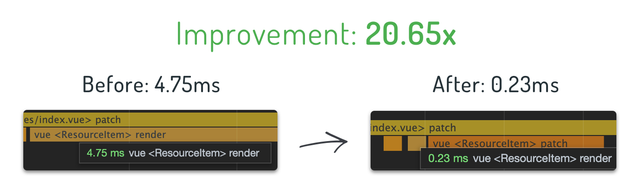
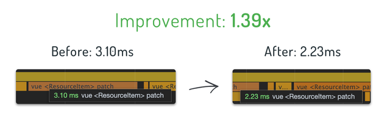

在第一篇文章中，我展现了一个技巧来[提高 Vue 中大型列表的性能](/articles/Vue/VueDose/1-提高%20Vue%20中大型列表的性能.html)，这是一个很好的开始。

但是并非所有情况都如此。

有时你需要创建繁重的组件来渲染，通常是因为它们所对应的业务功能比较复杂。昨天我遇到了一个类似的情景。

我正在使用 [StoryBook](https://www.storyblok.com/developers?utm_source=newsletter&utm_medium=logo&utm_campaign=vuedose) 创建页面。它们具有创建富文本字段的惊人的功能，内容管理员可以使用该字段来输入任何形式的文本，例如图片，块引用，加粗，斜体等。

当你从 Story Book API 获取富文本内容时，它有自己的数据结构，为了将数据渲染为 HTML，你必须使用 `storyblok-js-client` 的 `richTextResolver.render(content)` 方法。

我们可以将此功能封装到 `RichText.vue` 组件中，基础结构为：

```vue
<template>
  <div v-html="contentHtml"></div>
</template>

<script>
  export default {
    props: ["content"],
    computed: {
      contentHtml() {
        return this.$storyapi.richTextResolver.render(content);
      }
    }
  };
</script>
```

*注意: `$storyapi` 是 StoryBlok Client的一个实例，该实例来自 StoryBlock Nuxt 模块，这是我正在使用的模块，但这与本文的主题无关*

到目前为止还没有什么特别的。

惊喜来了。

渲染似乎是一项繁重的任务，当渲染具有相当数量的这个组件时，就要开始引起注意了。

现在想象一下：页面中有一个富文本组件列表，还有一个下拉列表来过滤，当更改下拉列表的过滤选项时，你将重新获取该过滤条件下的内容，并且重新渲染。

这里你可能会注意到 `richTextResolver.render` 的繁重: 当选择过滤值后，下拉列表滞后关闭。

原因是默认的 JavaScript 执行在**阻塞 UI 渲染**的主进程中。

问题清楚了以后，现在该如何解决？

简单：使用 Web Worker 进行富文本渲染任务。

*注意：我不会深入 Web Worker，请查看[其文档](https://developer.mozilla.org/en-US/docs/Web/API/Web_Workers_API/Using_web_workers)获取它的一些信息*

Web Workers 在单独的线程中运行，并不阻塞 UI 渲染，非常适合我们的情况。

请记住，Web Worker 是在自己的上下文中运行的，默认情况下，我们无法访问外部的上下文。但是我们需要访问 `storyblok-js-client` npm 模块，为此，Webpack 提供了 worker-loader。

首先，运行 `npm install -D web-worker` 来安装，然后需要对其进行配置。在 Nuxt.js 中，可以通过 `nuxt.config.js` 来配置：

```js
build: {
  extend(config, { isDev, isClient }) {
    config.module.rules.push({
      test: /\.worker\.js$/,
      use: { loader: "worker-loader" }
    });
  }
}
```

使用此配置，所有的 `*.worker.js` 将由 web-worker 处理。

接下来创建一个 `render-html.worker.js`:

```js
import StoryblokClient from "storyblok-js-client";

let storyClient = new StoryblokClient({});

// When the parent theard requires it, render the HTML
self.addEventListener("message", ({ data }) => {
  const result = storyClient.richTextResolver.render(data);
  self.postMessage(result);
});
```

这是一个 worker 的基础实现。你需要监听 `message` 事件，这是一个从 Vue.js 应用程序中与它通信的方式。然后，你可以获取从事件中获取 `data`，使用 `storyblok-js-client` 来渲染并使用 `self.poseMessage` 发送结果。

接下来更新 `RichText.vue` 组件来使用 service worker：

```vue
<template>
  <div v-html="contentHtml"></div>
</template>

<script>
  import Worker from "./render-html.worker.js";

  // Create the worker instance
  const worker = new Worker();

  export default {
    props: ["content"],
    data: () => ({
      contentHtml: ""
    }),
    mounted() {
      // Update the state with the processed HTML content
      worker.onmessage = ({ data }) => {
        this.contentHtml = data;
      };
      // Call the worker to render the content
      worker.postMessage(this.content);
    }
  };
</script>
```

## 结果

你是否想知道由此我们获得了多少性能提升？当然，如果不进行衡量，Web Performance 将毫无意义。

实际上，我有一篇文章供你[学习和了解如何衡量 Vue.js组件中的性能](https://vuedose.tips/tips/measure-runtime-performance-in-vue-js-apps)。因此，请务必阅读以更好的理解以下测试。

结果是：组件 `render` 快了 **20.65** 倍，组件 `patch` 快了 **1.39** 倍。





如果你不知道 `render` 和 `patch` 的含义，在[这篇文章](https://vuedose.tips/tips/measure-runtime-performance-in-vue-js-apps)中有说明。

### [原文链接](https://vuedose.tips/tips/use-web-workers-in-your-vuejs-component-for-max-performance)
