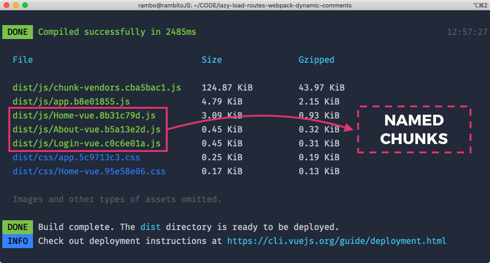

你可能经常像这样使用 Vue routes:

```js
import Vue from 'vue'
import VueRouter from 'vue-router'

import Home from '../views/Home.vue'
import About from '../views/About.vue'
import Login from '../views/Login.vue'

Vue.use(VueRouter)

const routes = [
  { path: '/', name: 'Home', component: Home },
  { path: '/about', name: 'About', component: About },
  { path: '/login', name: 'Login', component: Login }
]

const router = new VueRouter({
  routes
})

export default router
```

或者以这种方式，使用异步加载路由并指定 chunk 名称:

```js
const routes = [
  {
    path: '/',
    name: 'Home',
    component: () => import(/* webpackChunkName: "Home" */ '../views/Home.vue')
  },
  {
    path: '/about',
    name: 'About',
    component: () => import(/* webpackChunkName: "About" */ '../views/About.vue')
  },
  {
    path: '/login',
    name: 'Login',
    component: () => import(/* webpackChunkName: "Login" */ '../views/Login.vue')
  }
]
```

这样很好也没有问题。但是，在大多数情况下，我更偏向于使用不一样的代码组织方式。

如你所见，上面代码有一些重复的工作，因为你是一名了不起的程序员，你可以将 `array` 和 `router options` 一起使用，然后使用 `map()` 进行遍历，以免执行重复的工作。

```js
const routeOptions = [
  { path: '/', name: 'Home' },
  { path: '/about', name: 'About' },
  { path: '/login', name: 'Login' }
]

const routes = routeOptions.map(route => {
  return {
    ...route,
    component: () => import(`@/views/${route.name}.vue`)
  }
})

const router = new VueRouter({
  routes
})
```

通过使用 route `name` 作为 `import` 的参数，减少了 `component` 这个键的使用。

但是，如果要设置 chunk 的名称，会发生什么呢，我不是科学家，就我所掌握的只是而言，你无法在 JavaScript 使用动态注释，因此，我们牺牲了注释（`webpackChunkName`）来书写更少的代码，具体的取舍由你决定。

上面只是个开玩笑，**Webpack 可以做到！**从 webpack `2.6.0` 开始支持占位符 `[index]` 和 `[request]`，意味着你可以这样指定生成 chunk 的名称：

```js
const routeOptions = [
  { path: '/', name: 'Home' },
  { path: '/about', name: 'About' },
  { path: '/login', name: 'Login' }
]

const routes = routeOptions.map(route => {
  return {
    ...route,
    component: () => import(/* webpackChunkName: "[request]" */ `../views/${route.name}.vue`)
  }
})

const router = new VueRouter({
  routes
})
```

非常好！现在你有了具名 chunk，动态加载路由的强大功能，你可以通过 `npm run build` 在终端中运行来测试：



如你所见，在你的 Vue.js 应用程序中实现它非常容易。现在轮到你了。通过使用这个很棒的技巧开始改善你的 `router.js` 文件。

### [原文链接](https://vuedose.tips/tips/naming-webpack-chunks-on-lazy-loaded-routes-in-vuejs)
