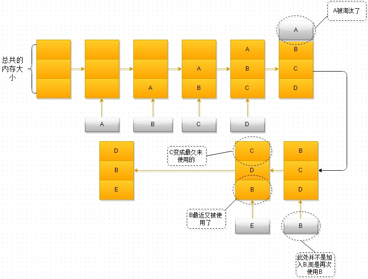

::: tip
1. 什么是 LRU
2. LRU 图解
3. LRU 在 Vue 上的应用
4. 实现 LRU 缓存机制
:::

<!-- more -->

## 什么是 LRU

缓存是一种提高数据读取性能的技术，在硬件设计、软件开发中都有着非常广泛的应用，比如常见的 CPU 缓存、数据库缓存、浏览器缓存等等。

例如浏览器缓存，当我们打开一个页面的时候，它会在发起真正的网络请求前，查询浏览器缓存，看是否有要请求的文件，如果有，浏览器将会拦截请求，返回缓存文件，并直接结束请求，不会再去服务器上下载。如果不存在，才会去服务器请求。

缓存的大小是有限的，当缓存被用满时，哪些数据应该被清理出去，哪些数据应该被保留？这就需要缓存淘汰策略来决定。

常见的缓存淘汰策略有：

- 先进先出策略 FIFO（First In，First Out）
- 最少使用策略 LFU（Least Frequently Used）
- 最近最少使用策略 LRU（Least Recently Used）

LRU 缓存淘汰策略，故名思义，就是根据数据的历史访问记录来进行淘汰数据，其核心思想是**如果数据最近被访问过，那么将来被访问的几率也更高**，优先淘汰最近没有被访问到的数据。

## LRU 图解



1. 最开始时，内存空间是空的，因此依次进入 A、B、C 是没有问题的
2. 当加入D时，就出现了问题，内存空间不够了，因此根据 LRU 算法，内存空间中 A 待的时间最为久远，选择A，将其淘汰
3. 当再次引用 B 时，内存空间中的 B 又处于活跃状态，而 C 则变成了内存空间中，近段时间最久未使用的
4. 当再次向内存空间加入 E 时，这时内存空间又不足了，选择在内存空间中待的最久的 C 将其淘汰出内存，这时的内存空间存放的对象就是 E->B->D

## LRU 在 Vue 上的应用

### keep-alive

在 Vue 中用于实现组件的缓存，当组件切换时缓存组件实例，而不是对组件进行销毁

```html
<!-- 基本 -->
<keep-alive>
  <component :is="view"></component>
</keep-alive>
```

`keep-alive` 有两个常用的 `prop`: `include` 和 `exclude`，用于对组件进行有条件的缓存，二者都可以用逗号分隔字符串、正则表达式或一个数组来表示。

在 `2.5.0` 版本中，`keep-alive` 新增了 `max` 属性，表示最多可以缓存多少组件实例。一旦这个数字达到了，在新实例被创建之前，已缓存组件中**最久没有被访问的实例**会被销毁掉。

这里，就用到了 LRU 缓存淘汰算法，在缓存组件数量中达到 `max` 时，新增组件实例会优先销毁最久没有被访问过的实例。

### 从源码看 `keep-alive` 实现

源码路径: `src/core/components/keep-alive.js`

整个代码不到 200 行

```js
/* @flow */

import { isRegExp, remove } from 'shared/util'
import { getFirstComponentChild } from 'core/vdom/helpers/index'

type VNodeCache = { [key: string]: ?VNode };

function getComponentName (opts: ?VNodeComponentOptions): ?string {
  return opts && (opts.Ctor.options.name || opts.tag)
}

// pattern 可以是数组，字符串，正则表达式，根据不同的类型去判断节点是否匹配
function matches (pattern: string | RegExp | Array<string>, name: string): boolean {
  if (Array.isArray(pattern)) {
    return pattern.indexOf(name) > -1
  } else if (typeof pattern === 'string') {
    return pattern.split(',').indexOf(name) > -1
  } else if (isRegExp(pattern)) {
    return pattern.test(name)
  }
  /* istanbul ignore next */
  return false
}

function pruneCache (keepAliveInstance: any /* keep-alive 组件实例*/, filter: Function /* 判断是否命中缓存的方法 */) {
  const { cache, keys, _vnode } = keepAliveInstance
  for (const key in cache) { // 遍历当前的缓存
    const cachedNode: ?VNode = cache[key]
    if (cachedNode) {
      const name: ?string = getComponentName(cachedNode.componentOptions)
      if (name && !filter(name)) { // 节点名称与传入的缓存规则不匹配，则从缓存中移除这个节点
        pruneCacheEntry(cache, key, keys, _vnode)
      }
    }
  }
}

// 删除 key 缓存
function pruneCacheEntry (
  cache: VNodeCache,
  key: string,
  keys: Array<string>,
  current?: VNode
) {
  const cached = cache[key]
  // 如果需要删除的缓存的组件 tag 不是当前渲染组件的 tag，才执行 $destroy
  if (cached && (!current || cached.tag !== current.tag)) {
    cached.componentInstance.$destroy()
  }
  cache[key] = null
  remove(keys, key)
}

const patternTypes: Array<Function> = [String, RegExp, Array]

export default {
  name: 'keep-alive',

  abstract: true, // 抽象组件，在组件实例建立父子关系时会被忽略，发生在 initLifecycle 过程中

  props: {
    include: patternTypes, // 只有匹配的组件需要缓存
    exclude: patternTypes, // 任何匹配的组件都不缓存
    max: [String, Number] // 缓存大小，缓存的为 vnode 对象，它会持有 DOM，当缓存很多时会占用内存
  },

  created () {
    // 初始化
    this.cache = Object.create(null) // 用于存储缓存的 vnode
    this.keys = [] // 存储缓存的 vnode 的 key 值
  },

  destroyed () {
    // 组件销毁时
    for (const key in this.cache) {
      pruneCacheEntry(this.cache, key, this.keys) // 删除所有的缓存
    }
  },

  mounted () {
    // 挂载时
    // 监听 include 和 exclude 变化，在变化时重新调整 cache，
    // 如果节点名称与传入的规则不匹配，则移除缓存中的节点
    this.$watch('include', val => {
      pruneCache(this, name => matches(val, name))
    })
    this.$watch('exclude', val => {
      pruneCache(this, name => !matches(val, name))
    })
  },

  render () {
    const slot = this.$slots.default // 默认插槽
    // 获取插槽的第一个组件 vnode，一般与其搭配的是 component 动态组件和 router-view
    const vnode: VNode = getFirstComponentChild(slot)
    // 获取自定义组件 options
    const componentOptions: ?VNodeComponentOptions = vnode && vnode.componentOptions
    if (componentOptions) {
      // check pattern
      const name: ?string = getComponentName(componentOptions) // 获取到组件的 name
      const { include, exclude } = this
      // 如果 name 不在 include 中，或者在 exclude 中，不需要做缓存，则直接返回 vnode，不进入后面的缓存逻辑
      if (
        // not included
        (include && (!name || !matches(include, name))) ||
        // excluded
        (exclude && name && matches(exclude, name))
      ) {
        return vnode
      }

      // 进入缓存的逻辑
      const { cache, keys } = this
      // 定义缓存的键，vnode.key 或者是 Ctor.cid 拼接 tag
      const key: ?string = vnode.key == null
        // same constructor may get registered as different local components
        // so cid alone is not enough (#3269)
        ? componentOptions.Ctor.cid + (componentOptions.tag ? `::${componentOptions.tag}` : '')
        : vnode.key

      // LRU 算法
      if (cache[key]) { // 如果命中缓存
        // vnode 的组件实例直接指向缓存的 vnode 的组件实例
        vnode.componentInstance = cache[key].componentInstance
        // make current key freshest
        // 调整 keys 的顺序，将 key 放入末尾，表示最新最近使用
        remove(keys, key)
        keys.push(key)
      } else { // 如果不在缓存中，则将 vnode 放入缓存
        cache[key] = vnode
        keys.push(key)
        // prune oldest entry
        // 如果配置了 max 且缓存的长度超过了 max，则从缓存中删除第一个（最近最少使用）
        if (this.max && keys.length > parseInt(this.max)) {
          pruneCacheEntry(cache, keys[0], keys, this._vnode)
        }
      }

      // keepAlive 标记位
      vnode.data.keepAlive = true
    }
    return vnode || (slot && slot[0])
  }
}
```

### 总结 `keep-alive` 的实现

在 `keep-alive` 缓存超过 `max` 时，使用的缓存淘汰算法就是 LRU 算法，它在实现的过程中用到了 `cache` 对象用于保存缓存的组件实例方便用 `key` 进行查找，`keys` 数组用于保存缓存组件的 `key`，当 `keep-alive` 中渲染一个需要缓存的实例时：

- 判断缓存中是否已缓存了该实例，缓存了则直接获取，并调整 `key` 在 `keys` 中的位置（移除 `keys` 中 `key` ，并放入 `keys` 数组的最后一位）
- 如果没有缓存，则缓存该实例，若 `keys` 的长度大于 `max`（缓存长度超过上限），则移除 `keys[0]` 缓存


## 实现 LRU 缓存机制

### 方法1：数组 + 对象

类似 vue keep-alive 实现

```js
var LRUCache = function (capacity) {
  this.keys = [];
  this.cache = Object.create(null);
  this.capacity = capacity;
};

LRUCache.prototype.get = function (key) {
  if (this.cache[key]) {
    remove(this.keys, key);
    this.keys.push(key);
    return this.cache[key];
  }
  return -1;
};

LRUCache.prototype.put = function (key, value) {
  if (this.cache[key]) {
    // 存在即更新
    this.cache[key] = value;
    remove(this.keys, key);
    this.keys.push(key);
  } else {
    // 不存在即加入
    this.keys.push(key);
    this.cache[key] = value;
    // 判断缓存是否已超过最大值
    if (this.keys.length > this.capacity) {
      removeCache(this.cache, this.keys, this.keys[0])
    }
  }
};

// 移除 key
function remove (arr, key) {
  if (arr.length) {
    const index = arr.indexOf(key);
    if (index > -1) {
      return arr.splice(index, 1);
    }
  }
}

// 移除缓存中 key
function removeCache (cache, keys, key) {
  cache[key] = null;
  remove(keys, key);
}
```

### 方法2：Map

Map 既能保存键值对，又能存储插入的顺序

```js
var LRUCache = function (capacity) {
  this.cache = new Map();
  this.capacity = capacity;
}

LRUCache.prototype.get = function (key) {
  if (this.cache.has(key)) {
    // 存在即更新
    let temp = this.cache.get(key);
    this.cache.delete(key);
    this.cache.set(key, temp);
    return temp;
  }
  return -1;
}

LRUCache.prototype.put = function (key, value) {
  if (this.cache.has(key)) {
    // 存在即更新（删除后加入）
    this.cache.delete(key)
  } else if (this.cache.size >= this.capacity) {
    // 不存在即加入
    // 缓存超过最大值，则移除最近没有使用的
    this.cache.delete(this.cache.keys().next().value);
  }
  this.cache.set(key, value);
}
```

## 参考

- [从浏览器缓存淘汰策略和 Vue 的 keep-alive 学习 LRU 算法](https://mp.weixin.qq.com/s/er5-zl3FKMAyvhx6xui7jQ)
- [Vue 源码分析 by ustbhuangyi](https://ustbhuangyi.github.io/vue-analysis/v2/extend/keep-alive.html)
- [缓存淘汰算法--LRU算法](https://zhuanlan.zhihu.com/p/34989978)
