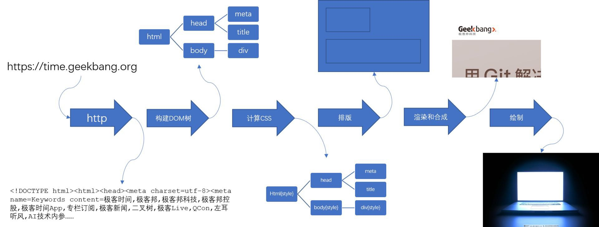
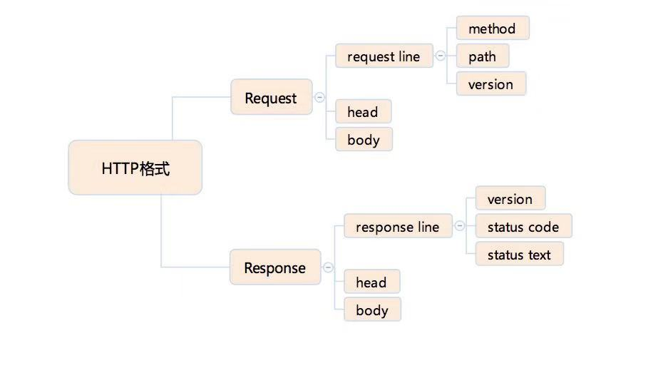
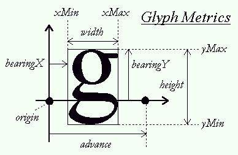

::: tip
1. 了解浏览器渲染过程
2. 了解 HTTP 协议
3. 如何构建 DOM 树
4. 浏览器对元素的排版
5. 浏览器对元素的绘制
:::

<!-- more -->

## 过程

1. 浏览器首先使用 HTTP 协议或者 HTTPS 协议，向服务端请求页面 （之前还有一步 DNS 查询）
2. 把请求回来的 HTML 代码经过解析，构建成 DOM 树
3. 计算 DOM 树上的 CSS 属性
4. 最后根据 CSS 属性对元素逐个进行渲染，得到内存中的位图
5. 一个可选的步骤是对位图进行合成，这会极大地增加后续绘制的速度
6. 合成之后，再绘制到界面上



> 从 HTTP 请求回来开始，就产生了流式的数据，后续的 DOM 树构建、CSS 计算、渲染、合成、绘制都是尽可能地流式处理前一步的产出：即不需要等到上一步骤完全结束，就开始处理上一步的输出，在浏览网页时，才会看到逐步出现的页面。

## HTTP 协议

HTTP 标准由 IETF 组织制定。

HTTP 协议是基于 TCP 协议出现的，对 TCP 协议来说，TCP 协议是一条双向的通讯通道，HTTP 在 TCP 的基础上，规定了 Request-Response 模式。这个模式决定了通讯必定由浏览器端首先发起。

HTTP 是存粹的文本协议，它是规定了使用 TCP 协议来传输文本格式的一个应用层协议。

### HTTP 协议格式



#### HTTP Method (方法)

> Request Line

- GET：浏览器通过地址栏访问页面都是 GET 方法。
- POST：表单提交产生 POST 方法。
- HEAD：HEAD 跟 GET 类似，只返回请求头，多数由 JavaScript 发起。
- PUT：添加资源，语义上的约束。
- DELETE ：删除资源，语义上的约束。
- CONNECT：CONNECT 多用于 HTTPS 和 WebSocket。
- OPTIONS：一般用于调试，多数线上服务都不支持。
- TRACE：一般用于调试，多数线上服务都不支持。

#### HTTP Status code (状态码) 和 Status text (状态文本)

> Response Line

- 1xx：临时回应，表示客户端请继续，被浏览器 HTTP 库直接处理掉了，不会让上层应用知晓

- 2xx：请求成功

    - 200：请求成功

- 3xx：表示请求的目标由变化，希望客户端进一步处理

    - 301&302：当前资源已经被转移，永久性与临时性的转移。 301 更接近一种报错，提示客户端下次别来了。
    - 304：客户端本地已经由缓存的版本，并且在 Request 中告诉了服务端，当服务端通过时间或者 tag，发现没有更新的时候，就会返回一个不含 body 的 304 状态。

- 4xx：客户端请求错误

    - 403：无权限
    - 404：表示请求的页面不存在

- 5xx：服务端请求错误

    - 500：服务端错误
   - 503：服务端暂时性错误，可以一会再试

#### HTTP Head (HTTP 头)

> 可以看作键值对。

**Request Header**

| Request Header | 规定 |
| ------ | ------ |
| Accept | 浏览器端接受的格式 |
| Accept-Encoding | 浏览器端接受的编码方式 |
| Accpet-Language | 浏览器端接受的语言，用于服务器端判断多语言 |
| Cache-Control | 控制缓存的时效性 |
| Connection | 连接方式，如果是 keep-alive，且服务器端支持，则会复用连接 |
| Host | HTTP访问使用的域名 |
| If-Modified-Since | 上次访问时的更改时间，如果服务器认为此时间后自己没有更新，则会给出 304 响应 |
| If-None-Match | 上次访问时使用的 E-Tag，通常是页面的信息摘要，这个比更改时间更准确一些 |
| User-Agent | 客户端标识 |
| Cookie | 客户端存储的 Cookie 字符串 |

**Response Header**

| Response Header | 规定 |
| ------ | ------ |
| Cache-Control | 缓存控制，用于通知各级缓存保存的时间，例如 max-age=0 表示不要缓存 |
| Connection | 连接类型，Keep-Alive表示复用连接 |
| Content-Encoding | 内容编码方式，通常是gzip |
| Content-Length | 内容的长度，有利于浏览器判断内容是否已经结束 |
| Content-Type | 内容类型，所有请求网页的都是 text/html |
| Date | 当前的服务器日期 |
| ETag | 页面的信息摘要，用于判断是否需要重新到服务器端取回页面 |
| Expires | 过期时间，用于判断下次请求是否需要到服务器端取回页面 |
| Keep-Alive | 保持连接不断时需要的一些信息，如 timeout=5，max=100 |
| Last-Modified | 页面上次修改的时间 |
| Server | 服务器软件的类型 |
| Set-Cookie | 设置 cookie 可以存在多个 |
| Via | 服务器端的请求链路，对一些调试场景至关重要的一个头 |

#### HTTP Request Body

> HTTP 请求的 body 主要用于提交表单场景。比较自由，服务端认可即可。

常见的 body 格式：

- application/json
- application/x-www-form-urlencoded
- multipart/form-data
- text/xml

使用 html 的 form 标签提交产生的 html 请求，默认会产生 application/x-www-form-urlencoded 数据格式，当由文件上传时，则使用 multipart/form-data。

## HTTPS

> 在 HTTP 协议的基础上，HTTPS 和 HTTP2 规定了更复杂的内容，但是它基本保持了 HTTP 的设计思想，即：使用上的 Request-Response 模式。

HTTPS 作用：

- 确定请求的目标服务端身份
- 保证传输的数据不会被网络中间节点窃听或者篡改

HTTPS 是使用加密通道来传输 HTTP 的内容。 HTTPS 首先与服务端建立一条 TLS 加密通道。TLS 构建于 TCP 协议之上，它实际上是对传输的内容做一次加密，所以从传输内容上看，HTTPS 跟 HTTP 没有任何区别。

## HTTP2

> HTTP 2 是 HTTP 1.1 的升级版本。

HTTP 2.0 最大的改进有两点，一是支持服务端推送，二是支持 TCP 连接推送。

服务端推送能够在客户端发送第一个请求到服务端时，提前把一部分内容推送给客户端，放入缓存中，可以避免客户端请求顺序带来的并行度不高，从而导致性能问题。

TCP 连接复用，则使用同一个 TCP 连接来传输多个 HTTP 请求，避免了 TCP 连接建立时的三次握手开销，和初建 TCP 连接时传输窗口小的问题。

## 解析请求回来的 HTML 代码，构建 DOM 树

处理 response 的 body 部分的 HTML 代码

### 词(`token`)

HTML 的结构并不复杂，日常开发需要 90% 的 “词” （指编译原理的术语 `token`，表示最小的有意义的单元），种类大约只有`标签开始`、`属性`、`标签结束`、`注释`、`CDATA 节点`几种。

### 词的拆分

```html
<p class="a">text text text</p>
```

从最小有意义单元的定义来拆分，拆成词（`token`）:

- `<p 标签的开始`
- `class="a" 属性`
- `> ”标签开始“的结束`
- `text text text 文本`
- `</p> 标签的结束`

### 总结

| 示例语 | 解释 |
| ------ | ------ |
| `<abc` | “开始标签”的开始 |
| `a = "xxx"` | 属性 |
| `>` | "开始标签"的结束 |
| `/abc>` | 结束标签 |
| `hello world` | 文本节点 |
| `<!-- xxx -->` | 注释 |
| `<![CDATA[hello world!]]>` | CDATA数据节点 |

### 解析过程

一串字符流，从第一个字符开始读，第一个字符是 `<`，知道这不是一个文本节点，接下来继续读到 `x`，那么就不是 `注释` 和 `CDATA节点`，再继续读，直到遇到 `>` 或者空格，就可以得到上面所讲的词（token）了。

每读一个字符，都要根据当前的状态去判断结果，浏览器工程师要想实现把字符流解析成词（token），最常见的方案是使用状态机。

## 状态机

> 状态机设计属于编译原理的基本知识，这里仅简单介绍

绝大多数语言的词法部分都是用状态机实现的。

HTML 官方文档规定了 80 个状态。

用简单状态来解释原理：

状态机的初始状态，我们仅仅区分 `<` 和 `非<`

- 如果是非 < 字符，可以认为进入了一个文本节点
- 如果是 <，那么进入一个标签状态

在标签状态时，也有一些可能性

- 下一个字符如果是 !，那么可能进入了 注释节点 或者 CDATA 节点
- 下一个字符如果是 /，那么可以确定进入了结束标签
- 下一个字符是字母，可以确定进入了开始标签
- 如果要完整的处理各种 HTML 标准中定义的东西，还要考虑 ?, % 等内容。

## 构建 DOM 树

得到了简单的词，就要变成 DOM 树了，这个过程用栈来实现。任何语言都有栈。

在栈接收词的同时，即开始构建 DOM 树，当接收完所有的输入，栈顶就是最后的根节点，DOM 树的产出就是这个 stack 的第一项。

为了构建 DOM 树，需要一个 Node 类，接下来的所有节点都会是这个 Node 类的实例。

构建 DOM 树:

- 栈顶元素就是当前节点
- 遇到属性，就添加到当前节点
- 遇到文本节点，如果当前节点是文本节点，则跟文本节点合并，否则入栈成为当前节点的子节点
- 遇到注释节点，作为当前节点的子节点
- 遇到 tag start 就入栈一个节点，当前节点就是这个节点的父节点
- 遇到 tag end 就出栈一个节点

HTML 具有很强的容错能力，当 tag end 跟栈顶的 start tag 不匹配的时候如何处理，又是一个极其复杂的规则。W3C整理了这些[规则](http://w3c.github.io/html/syntax.html#tree-construction)。

## 为 DOM 树添加上 CSS 属性

CSS 选择器这个名字好像意思是 CSS 规则是 DOM 树构建好了以后，再进行选择并给它添加样式。实际上，这个过程并不是这样的。

浏览器会尽量流式处理整个过程。构建 DOM 树的过程是： 从父到子，从先到后，一个一个节点构造，并且挂载到 DOM 树上的。在这个过程中，浏览器会同步的把 CSS 属性计算出来，依次拿到上一步构造好的元素，去检查它匹配到了哪些规则，再根据规则优先级，做覆盖和调整，所以理解成 “CSS 匹配器” 更合适。

回顾 CSS 选择器符号：

- `空格`：后代，选中它的子节点和所有子节点的后代节点
- `>`: 子代，选中它的子节点
- `+`: 直接后继选择器，选中它的下一个相邻节点
- `～`: 后继，选中它的下一个相邻节点
- `||`: 列，选中表格的一列

这里的选择器有个特点，那就是选择器的出现顺序，必定跟构建 DOM 树的顺序一致，这是一个 CSS 设计的原则，即保证选择器在 DOM 树构建到当前节点时，已经可以准确判断是否匹配，不需要后续节点信息。也就是说，未来也不可能会出现“父元素选择器”，因为父元素选择器要求根据当前节点的子节点来判断当前节点是否被选中，而父节点会先于子节点构建。

## 确定每一个元素的位置

现在已经给 DOM 元素添加了用于展现的 CSS 属性，现在浏览器的工作就是确定每一个元素的位置。基本原则依然不变，就是尽可能流式的处理上一步骤的输出。在构建 DOM 和 计算 CSS 属性这两个步骤，我们的产出都是一个一个的元素，但是在排版这个步骤中，有些情况下，就没法做到这样，比如表格相关排版、flex 排版 和 grid 排版，它们有显著的特点，那就是子元素之间具有关联性。

### 基本概念

`排版`最初的意思是确定每一个字的位置。在现代浏览器中，排版仍然借用了这个概念，但是排版的内容更加复杂，包括文字，图片，图形，表格等。我们把浏览器确定它们位置的过程，叫作排版。

浏览器最基本的排版方案是正常流排版，它包含了顺次排布和拆行等规则，跟我们平时书写文字的方式一致，所以我们把它叫做正常流。

浏览器的文字排版遵循公认的文字排版规范，文字排版是一个复杂的系统，它规定了行模型和文字在行模型中的排布，行模型规定了行项，行底，文字区域，基线等对齐方式。

浏览器支持不同语言，因为不同语言的书写顺序不一致，所以浏览器的文本排版还支持双向文字系统。

浏览器又可以支持元素和文字的混排，元素被定义为占据长方形的区域，还允许边框，边距和留白，这个就是所谓的`盒模型`。

在正常流的基础上，浏览器还支持两类元素：`绝对定位元素`和`浮动元素`。

- `绝对定位元素`把自身从正常流抽出，直接由 `top` 和 `left` 等属性确定自身的位置，不参加排版计算，也不影响其他元素。绝对定位元素由 `position` 属性控制。
- `浮动元素`则是使得自己在正常流的位置向左或者向右移动到边界，并且占据一块排版空间。浮动元素由 `float` 属性控制。

除了正常流，浏览器还支持其他排版方式，比如现在非常常用的 `flex` 排版，这些排版方式由外部的 `display` 属性来控制。

### 正常流文字排版

把文字依次书写的延伸方向称为主轴或者主方向，换行延伸的方向，跟主轴垂直交叉，被成为交叉轴或者交叉方向。

文字排版受字体影响，字体提供字形本身包含的信息。



此外，文字排版还受到一些 css 属性影响如 `line-height`，`word-spacing`等。

在正常流的文字排版中，多数元素被当作长方形盒来排版，而只有 display 为 `inline` 的元素是被拆成文本来排版。display 为 `inline` 的元素中的文字排版时会被直接排入文字流中。

### 正常流中的盒

在正常流中，display 不为 `inline` 的元素或者伪元素，会以盒的形式跟文字一起排版。多数 display 属性都可以分成两部分：内部的排版和是否 inline，带有 inline- 前缀的盒，被称作`行内级盒`。

根据盒模型，一个盒具有 `margin`、`border`、`padding`、`width/height` 等属性，它在主轴方向占据的空间是由对应方向的这几个属性只和决定的，而 `vertical-align` 属性决定了盒在交叉轴方向的位置，同时也会影响实际行高。

所以浏览器对行的排版，一般是先行内布局，再确定行的位置，根据行的位置计算出行内盒和文字的排版位置。

块级盒比较简单，它总是单独占据一整行，计算出交叉轴方向的高度即可。

### 绝对定位元素

position 属性为 `absolute` 的元素，一种跟正常流无关的独立排版模式，逐层找到其父级的 position `非 static` 元素即可。

### 浮动元素排版

浏览器对 `float` 的处理是先排入正常流，再移动到排版宽度的最左/最右。移动之后，`float` 元素占据了一块排版的空间，因此，在数行之内，主轴方向的排版距离发生了变化，直到交叉轴方向的尺寸超过了浮动元素的交叉轴尺寸范围，主轴排版尺寸才会恢复。

`float` 元素排布完成后，`float` 元素所在的行需要重新确定位置。

### 其它的排版

CSS 的每一种排版都有一个很复杂的规定，实际实现形式也各不相同。比如 `flex` 排版，支持了 `flex` 属性，`flex` 属性将每一行排版后的剩余空间平均分配给主轴方向的 width/height 属性。浏览器支持的每一种排版方式，都是按照对应标准来实现的。

## 浏览器的位图操作

我们已经把 `url` 变成 字符流，把字符流变成词（`token`）流，把词（`token`）流构造成 DOM 树，把不含样式信息的 DOM 树应用 CSS 规则，变成包含样式信息的 DOM 树，并且根据样式信息，计算了每个元素的位置和大小。

最后的步骤，就是根据这些样式信息和大小信息，为每个元素在内存中渲染它的图形，并且把它绘制到对应的位置。

### 渲染

> 位图是在内存里建立一张二维表格，把一张图片的每个像素对应的颜色保存进去（位图信息也是 DOM 树中占据浏览器内存最多的信息，在做内存占用优化时，主要就是考虑这一部分）。

浏览器中渲染这个过程，就是把每一个元素对应的盒变成位图。这里的元素包括 HTML 元素和伪元素，一个元素可能对应多个盒。每一个盒对应着一张位图。

渲染过程非常复杂，总体来说分为两个大类：图形和文字。

盒的背景、边框、svg 元素、阴影等特性，都需要绘制图形类。这一部分需要一个底层库来支持。一般的操作系统会提供一个底层库，比如 Android 中的 Skia，而 Windows 平台则有 GDI，一般的浏览器会做一个兼容层来处理掉平台差异。

这些盒的特性如何绘制，每一个都有对应的标准规定，而每一个的实现都可以作为一个独立的课题研究。

盒中的文字，也需要用底层库来支持，叫做字体库。字体库提供读取字体文件的基本能力，它能根据字符的码点抽取出字形。

这里的渲染过程是不会把子元素绘制到渲染的位图上的，这样，当父子元素的相对位置发生变化时，可以保证渲染的结果能够最大程度被缓存，减少重新渲染。

### 合成

渲染过程不会把子元素渲染到位图上面，合成的过程，就是为一些元素创建一个 “合成后的位图”，称为`合成层`，把一部分子元素渲染到合成的位图上面。

“应该为哪些元素创建合成后的位图，把哪些子元素渲染到合成的位图上呢？”

我们需要建立合成策略。合成是一个性能考量，合成的目标就是提高性能，根据这个目标，我们建立的原则就是最大限度减少绘制次数的原则。

新的 CSS 标准中，规定了 `will-change` 属性，可以由业务代码来提示浏览器的合成策略，灵活运用这样的特性，可以大大提升合成策略的效果。

### 绘制

绘制是把“位图最终绘制到屏幕上，变成肉眼可见的图像”的过程。一般来说，浏览器并不需要用代码来处理这个过程，浏览器只需要把最终要显示的位图交给操作系统即可。

CSS 性能优化，应该尽量避免 `重排` 和 `重绘`，前者讲的是上面的排版行为，后者模糊地指向本节的这三个步骤。这个说法大体不算错，但不够准确，实际上，“绘制”发生的频率比我们想象中要高得多。鼠标的每次移动，都造成了重新绘制，如果不重新绘制，就会产生大量的鼠标残影。这个时候限制绘制的面积就很重要了，在计算机图形学中，使用的方案是“脏矩形”算法，也就是把屏幕均匀地分成若干矩形区域，我们只重新绘制它所影响到的几个矩形区域就够了。

设置合适的矩形区域大小，可以很好地控制绘制时的消耗。重新绘制脏矩形区域时，把所有与矩形区域有交集的合成层（位图）的交集部分绘制即可。

`渲染`过程把元素变成位图，`合成`把一部分位图变成合成层，最终的`绘制`过程把合成层显示到屏幕上。当绘制完成时，就完成了浏览器的最终任务，把一个 URL 最后变成了一个可以看的网页图像。
