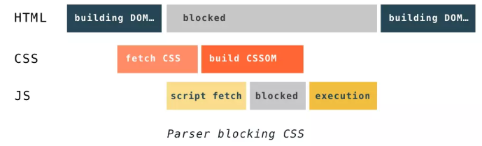

::: tip
1. 页面加载过程
2. 浏览器渲染过程
3. 相关问题
4. 性能优化
:::

<!-- more -->

## 前言

浏览器的内核是指支持浏览器运行的最核心的程序，分为两个部分，一是渲染引擎，另一个是 JS 引擎。渲染引擎在不同的浏览器中也不是都相同的。目前市面上常见的浏览器内核可以分为这四种：Trident（IE）、Gecko（火狐）、Blink（Chrome、Opera）、Webkit（Safari）。这里面最耳熟能详的可能就是 Webkit 内核了，Webkit 内核是当下浏览器世界真正的霸主。
本文以 Webkit 为例，对现代浏览器的渲染过程进行一个深度的剖析。

## 页面加载过程

1. 浏览器根据 DNS(Domain Name System) 服务器得到域名的 IP 地址
2. 向这个 IP 的机器发送 HTTP 请求
3. 服务器收到、处理并返回 HTTP 请求
4. 浏览器得到返回内容

返回的内容其实就是一堆 HTML 格式的字符串，因为只有 HTML 格式浏览器才能正确解析，这是 W3C 标准的要求。接下来就是浏览器的渲染过程。

## 浏览器渲染过程

**1.浏览器会解析三个东西**

- 一是 HTML/SVG/XHTML，HTML字符串描述了一个页面的结构，浏览器会把 HTML 结构字符串解析转换 DOM 树形结构

- 二是CSS，解析 CSS 会产生 CSS 规则树，它和 DOM 结构比较像

- 三是 Javascript 脚本，等到 Javascript 脚本文件加载后， 通过 DOM API 和 CSSOM API 来操作 DOM Tree 和 CSS Rule Tree

**2.解析完成后，浏览器引擎会通过 DOM Tree 和 CSS Rule Tree 来构造 Rendering Tree**

- Rendering Tree 渲染树并不等同于 DOM 树，渲染树只会包括需要显示的节点和这些节点的样式信息。（display 为 none 的元素不会在渲染树中显示）
- CSS 的 Rule Tree 主要是为了完成匹配并把 CSS Rule 附加上 Rendering Tree 上的每个Element（也就是每个 Frame）
- 然后，计算每个 Frame 的位置，这又叫 layout 和 reflow 过程

**3.最后通过调用操作系统 Native GUI 的 API 绘制**

> 接下来针对这其中所经历的重要步骤详细阐述

## 构建DOM

宏观步骤：

::: tip
字节数据 -> 字符串 -> Token（词） -> Node -> DOM
:::

- 浏览器从磁盘或网络读取 HTML 的原始字节，并根据文件的指定编码（例如 UTF-8）将它们转换成字符串

在网络中传输的内容其实都是 0 和 1 这些字节数据。当浏览器接收到这些字节数据以后，它会将这些字节数据转换为字符串，也就是我们写的代码。

- 将字符串转换成 Token，例如：`<html>`、`<body>` 等。**Token 中会标识出当前 Token 是“开始标签”或是“结束标签”亦或是“文本”等信息。**

- 生成节点对象并构建DOM

事实上，构建DOM的过程中，不是等所有 Token 都转换完成后再去生成节点对象，而是一边生成Token 一边消耗 Token 来生成节点对象（流式的处理）。换句话说，每个 Token 被生成后，会立刻消耗这个 Token 创建出节点对象。注意：带有结束标签标识的 Token 不会创建节点对象。

## 构建CSSOM

DOM 会捕获页面的内容，但浏览器还需要知道页面如何展示，所以需要构建 CSSOM。

构建 CSSOM 的过程与构建 DOM 的过程非常相似，当浏览器接收到一段 CSS，浏览器首先要做的是识别出 Token，然后构建节点并生成 CSSOM：

::: tip
字节数据 -> 字符串 -> Token（词） -> Node -> CSSOM
:::

在这一过程中，浏览器会确定下每一个节点的样式到底是什么，并且这一过程其实是很消耗资源的。因为样式你可以自行设置给某个节点，也可以通过继承获得。在这一过程中，浏览器得递归 CSSOM 树，然后确定具体的元素到底是什么样式(这一过程也是尽量流式的处理)。

**注意：CSS 匹配 HTML 元素是一个相当复杂和有性能问题的事情。所以，DOM 树要小，CSS 尽量用 id 和 class，千万不要过渡层叠下去。**

## 构建渲染树

当我们生成 DOM 树和 CSSOM 树以后，就需要将这两棵树组合为渲染树。

在这一过程中，不是简单的将两者合并就行了。渲染树只会包括需要显示的节点和这些节点的样式信息，如果某个节点是 `display: none` 的，那么就不会在渲染树中显示。

渲染过程中，如果遇到 `<script>` 就停止渲染，执行 JS 代码。
因为浏览器有 GUI 渲染线程与 JS 引擎线程，为了防止渲染出现不可预期的结果，这两个线程是**互斥**的关系。JavaScript 的加载、解析与执行会**阻塞** DOM 的构建，也就是说，在构建 DOM时，HTML 解析器若遇到了 JavaScript，会暂停构建 DOM，将控制权移交给 JavaScript 引擎，等 JavaScript 引擎运行完毕，浏览器再从中断的地方恢复 DOM 构建。

也就是说，如果你想首屏渲染的越快，就越不应该在首屏就加载 JS 文件，这也是都建议将 script 标签放在 body 标签底部的原因。当然在当下，并不是说 script 标签必须放在底部，因为你可以给 script 标签添加 `defer` 或者 `async` 属性（下文会介绍这两者的区别）。

**JS 文件不只是阻塞 DOM 的构建，它会导致 CSSOM 也阻塞 DOM 的构建。**

这是因为 JavaScript 不只是可以改 DOM，它还可以更改样式，也就是它可以更改 CSSOM。因为不完整的 CSSOM 是无法使用的，如果 JavaScript 想访问 CSSOM 并更改它，那么在执行JavaScript 时，必须要能拿到完整的 CSSOM。所以就导致了如果浏览器尚未完成 CSSOM 的下载和构建，而却想在此时运行脚本，那么浏览器将延迟脚本执行和 DOM 构建，直至其完成 CSSOM 的下载和构建。也就是说，**在这种情况下，浏览器会先下载和构建 CSSOM，然后再执行 JavaScript，最后在继续构建DOM。**



## 布局与绘制

当浏览器生成渲染树以后，就会根据渲染树来进行布局（也可以叫做回流（reflow））。这一阶段浏览器要做的事情是要弄清楚各个节点在页面中的确切位置和大小。通常这一行为也被称为“自动重排”。

布局流程的输出是一个“盒模型”，它会精确地捕获每个元素在视口内的确切位置和尺寸，所有相对测量值都将转换为屏幕上的绝对像素。

布局完成后，浏览器会立即发出“Paint Setup”和“Paint”事件，将渲染树转换成屏幕上的像素。

> 以上详细介绍了浏览器工作流程中的重要步骤，接下来讨论几个相关的问题：

## 相关问题

### async 和 defer 的作用是什么？有什么区别?


蓝色线代表 JavaScript加载
红色线代表 JavaScript执行
绿色线代表 HTML 解析

**1.情况1`<script src="script.js"></script>`**

没有 `defer` 或 `async`，浏览器会立即加载并执行指定的脚本，也就是说不等待后续载入的文档元素，读到就加载并执行。

**2.情况2`<script async src="script.js"></script>`(异步下载)**

async 属性表示**异步执行**引入的 JavaScript，与 defer 的区别在于，如果已经加载好，就会开始执行——无论此刻是 HTML 解析阶段还是 DOMContentLoaded 触发之后。需要注意的是，这种方式加载的 JavaScript 依然会阻塞 load 事件。换句话说，async-script 可能在 DOMContentLoaded 触发之前或之后执行，但一定在 load 触发之前执行。

**3.情况3`<script defer src="script.js"></script>`(延迟执行)**

defer 属性表示**延迟执**行引入的 JavaScript，即这段 JavaScript 加载时 HTML 并未停止解析，这两个过程是**并行**的。整个 document 解析完毕且 defer-script 也加载完成之后（这两件事情的顺序无关），会执行所有由 defer-script 加载的 JavaScript 代码，然后触发 DOMContentLoaded 事件。

defer 与相比普通 script，有两点区别：
- 载入 JavaScript 文件时不阻塞 HTML 的解析
- 执行阶段被放到 HTML 标签解析完成之后

在加载多个 JS 脚本的时候，async 是**无顺序**的加载，而 defer 是**有顺序**的加载。

### 为什么操作 DOM 慢

> 把 DOM 和 JavaScript 各自想象成一个岛屿，它们之间用收费桥梁连接。——《高性能 JavaScript》

JS 是很快的，在 JS 中修改 DOM 对象也是很快的。在 JS 的世界里，一切是简单的、迅速的。但 DOM 操作并非 JS 一个人的独舞，而是两个模块之间的协作。

因为 DOM 是**属于渲染引擎**中的东西，而 JS 又是 **JS 引擎**中的东西。当我们用 JS 去操作 DOM 时，本质上是 JS 引擎和渲染引擎之间进行了“跨界交流”。这个“跨界交流”的实现并不简单，它依赖了桥接接口作为“桥梁”。

过“桥”要收费——这个开销本身就是不可忽略的。我们每操作一次 DOM（**不管是为了修改还是仅仅为了访问其值**），都要过一次“桥”。过“桥”的次数一多，就会产生比较明显的性能问题。因此“减少 DOM 操作”的建议，并非空穴来风。

### 你真的了解回流和重绘吗

渲染的流程基本上是这样：

1. 计算 CSS 样式
2. 构建Render Tree
3. Layout – 定位坐标和大小
4. 正式开画

这里重要要说两个概念，一个是 `Reflow`，另一个是 `Repaint`

- 重绘：当我们对 DOM 的修改导致了样式的变化、却并未影响其几何属性（比如修改了颜色或背景色）时，浏览器不需重新计算元素的几何属性、直接为该元素绘制新的样式（跳过了回流环节）。
- 回流：当我们对 DOM 的修改引发了 DOM 几何尺寸的变化（比如修改元素的宽、高或隐藏元素等）时，浏览器需要重新计算元素的几何属性（其他元素的几何属性和位置也会因此受到影响），然后再将计算的结果绘制出来。这个过程就是回流（也叫重排）

当网页生成的时候，至少会渲染一次。在用户访问的过程中，还会不断重新渲染。重新渲染会重复回流 + 重绘或者只有重绘。

**回流必定会发生重绘，重绘不一定会引发回流。**

重绘和回流会在我们设置节点样式时频繁出现，同时也会很大程度上影响性能。回流所需的成本比重绘高的多，改变父节点里的子节点很可能会导致父节点的一系列回流。

**1.常见引起回流属性和方法**

任何会改变元素**几何信息**(元素的位置和尺寸大小)的操作，都会触发回流，

- **添加或者删除**可见的 DOM 元素
- 元素**尺寸改变**——边距、填充、边框、宽度和高度
- **内容变化**，比如用户在 input 框中输入文字
- 浏览器**窗口尺寸改变**——resize 事件发生时
- **计算 offsetWidth 和 offsetHeight 属性**
- 设置 **style 属性**的值

**2.常见引起重绘属性和方法**

- `color`
- `border-style`
- `visibility`
- `background`
- `text-decoration`
- `background-image`
- `background-position`
- `background-repeat`
- `outline-color`
- `outline`
- `outline-style`
- `border-radius`
- `outline-width`
- `box-shadow`
- `background-size`

**3.如何减少回流、重绘**

- 使用 transform 替代 top
- 使用 visibility 替换 display: none ，因为前者只会引起重绘，后者会引发回流（改变了布局）
- 不要把节点的属性值放在一个循环里当成循环里的变量。

```js
for(let i = 0; i < 1000; i++) {
  // 获取 offsetTop 会导致回流，因为需要去获取正确的值
  console.log(document.querySelector('.test').style.offsetTop)
}
```

- 不要使用 table 布局，可能很小的一个小改动会造成整个 table 的重新布局
- 动画实现的速度的选择，动画速度越快，回流次数越多，也可以选择使用 requestAnimationFrame
- CSS 选择符从右往左匹配查找，避免节点层级过多
- 将频繁重绘或者回流的节点设置为图层，图层能够阻止该节点的渲染行为影响别的节点。比如对于 video 标签来说，浏览器会自动将该节点变为图层。

## 性能优化策略

基于上面介绍的浏览器渲染原理，DOM 和 CSSOM 结构构建顺序，初始化可以对页面渲染做些优化，提升页面性能。

- JS优化： `<script>` 标签加上 defer属性 和 async属性 用于在**不阻塞页面文档解析**的前提下，控制脚本的下载和执行。
  - defer属性： 用于开启**新的线程**下载脚本文件，并使脚本在**文档解析完成后执行**
  - async属性： HTML5 新增属性，用于**异步下载**脚本文件，**下载完毕立即解释执行代码**

- CSS优化： `<link>` 标签的 rel属性 中的属性值设置为 `preload` 能够让你在你的 HTML 页面中可以指明哪些资源是在页面加载完成后即刻需要的，最优的配置加载顺序，提高渲染性能

## 总结

- 浏览器工作流程：构建DOM -> 构建CSSOM -> 构建渲染树 -> 布局 -> 绘制。
- CSSOM 会**阻塞**渲染，只有当 CSSOM 构建完毕后才会进入下一个阶段构建渲染树。
- 通常情况下 DOM 和 CSSOM 是并行构建的，但是当浏览器遇到一个不带 defer 或 async 属性的 script 标签时，DOM构建将暂停，如果此时又恰巧浏览器尚未完成 CSSOM 的下载和构建，由于 JavaScript 可以修改 CSSOM，所以需要等CSSOM 构建完毕后再执行 JS，最后才重新 DOM 构建。

## 参考

- [深入浅出浏览器渲染原理](https://github.com/ljianshu/Blog/issues/51)
- [async 和 defer 的区别 | SegmentFault]((https://segmentfault.com/q/1010000000640869))
- [浏览器的渲染原理简介](https://coolshell.cn/articles/9666.html)
- [前端面试之道](https://juejin.im/book/5bdc715fe51d454e755f75ef/section/5c024ecbf265da616a476638)
- [关键渲染路径](https://mp.weixin.qq.com/s?__biz=MzA5NzkwNDk3MQ==&mid=2650588806&idx=1&sn=408a54e7c8102fd6944c9a40b119015a&chksm=8891d6a2bfe65fb42f493fe9a4dab672dd7e440f31e753196cee0cfbc6696e4f8dd3a669e040&mpshare=1&scene=1&srcid=1228ZrXsmbZKcgCSu7zTVDwy#)
- [前端性能优化原理与实践](https://juejin.im/book/5b936540f265da0a9624b04b/section/5bac3a4df265da0aa81c043c)
- [由入门到专家：前端全链路开发实践手册](https://juejin.im/book/5c47343bf265da612b13e5c0/section/5c4737375188255de8397ae3)
- [Web 前端面试指南与高频考题解析](https://juejin.im/book/5a8f9ddcf265da4e9f6fb959/section/5a8f9f7bf265da4e82635e46)
